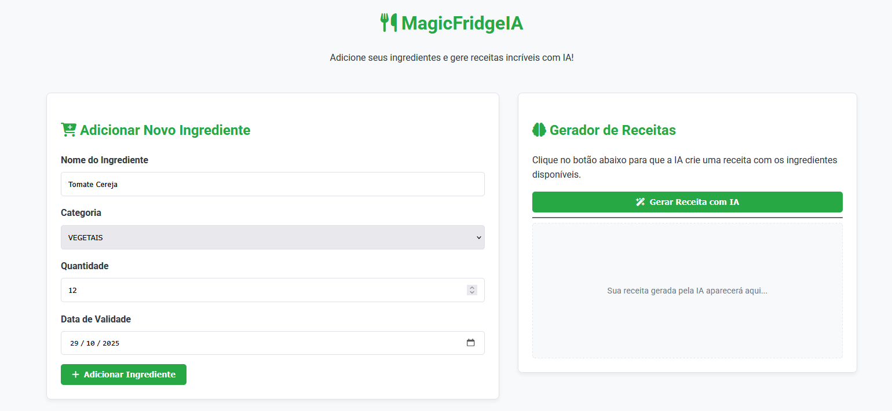
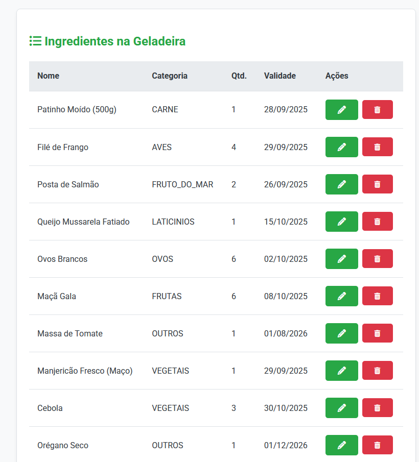
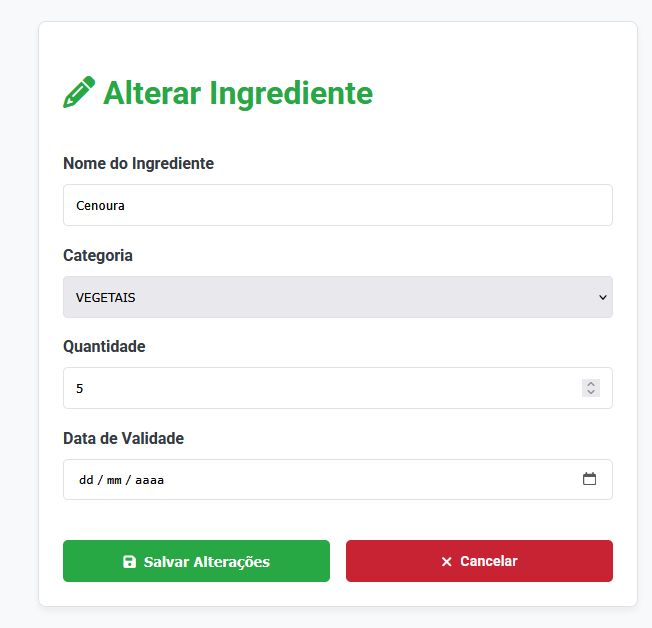
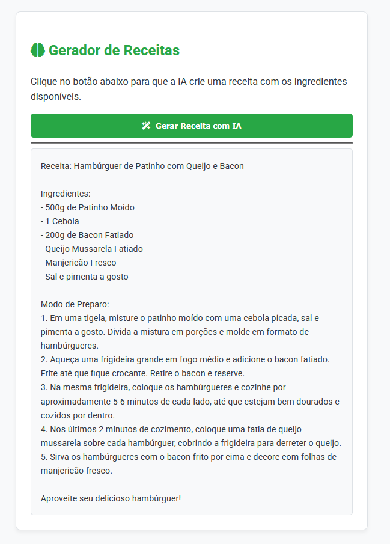

# MagicFridgeIA - Geladeira Inteligente com Geração de Receitas via IA


[](https://openai.com/api/)

Aplicação web full-stack que simula o gerenciamento de uma geladeira, permitindo ao usuário cadastrar ingredientes e, com um único clique, solicitar à API da OpenAI que gere uma receita criativa utilizando os itens disponíveis. O projeto foi desenvolvido como um estudo aprofundado no ecossistema Java, com foco na integração de serviços de IA, na construção de interfaces web reativas com Thymeleaf e nas melhores práticas de desenvolvimento com Spring Boot.

---

### 📸 Visão Geral da Interface

A aplicação conta com um dashboard moderno e funcional, que centraliza todas as interações do usuário.

#### **Dashboard Principal:** 
*O painel centraliza o formulário de adição de ingredientes e a opção da geração de receita com IA.*



*Logo abaixo há uma lista com todos os itens adicionados e as opções de **deletar** e **editar** um item.*


#### **Página de Edição Dedicada:**
*Uma interface limpa para a alteração de um ingrediente específico, garantindo uma experiência de usuário fluida.*



#### **Geração de Receitas com IA:**
*Após adicionar os ingredientes, o usuário pode solicitar uma receita, que é exibida dinamicamente na mesma tela.*



---

## 📜 Descrição Completa

**MagicFridgeIA** é uma solução criativa para um problema comum: o que cozinhar com o que se tem em casa? A aplicação permite o gerenciamento completo do inventário de uma geladeira, desde o cadastro de itens com suas respectivas categorias e validades até a exclusão e alteração dos mesmos.

O grande diferencial do projeto é a sua integração com a **API da OpenAI**. O back-end consulta todos os ingredientes disponíveis no banco de dados, formata essa lista em um prompt otimizado e o envia para um modelo GPT. A resposta da IA, uma receita completa, é então exibida na interface.

O projeto foi construído com uma clara separação de responsabilidades, utilizando controllers `@RestController` para uma potencial API JSON e um `@Controller` dedicado para a interface de usuário, renderizada no lado do servidor com **Thymeleaf**. Para garantir a portabilidade e simplificar a configuração do ambiente, a aplicação foi totalmente containerizada com **Docker** e orquestrada com **Docker Compose**, permitindo que todo o sistema (aplicação + banco de dados PostgreSQL) seja executado de forma isolada e consistente com um único comando.

---

### 🚀 Funcionalidades

- ✅ **CRUD Completo de Ingredientes:** Endpoints e interface para Criar, Ler, Atualizar e Deletar itens na geladeira.
- 🖥️ **Dashboard Interativo:** Interface web única construída com Thymeleaf para todas as operações.
- 🤖 **Integração com IA:** Comunicação reativa com a API da OpenAI usando `WebClient` para gerar receitas.
-  dynamic **Prompt Dinâmico:** A aplicação busca os dados do banco em tempo real para construir o prompt que é enviado à IA.
- 🗃️ **Versionamento de Banco de Dados:** Uso do **Flyway** para criar e gerenciar o schema do banco de dados de forma automatizada.
- ✨ **Design Moderno:** Interface com CSS puro, focada em uma experiência de usuário limpa e agradável.

---

### 💪 Desafios Superados

Durante o desenvolvimento, vários desafios foram superados, servindo como grandes pontos de aprendizado:

- **Integração com API Externa (`401 Unauthorized`):** Um longo processo de depuração para resolver falhas de autenticação com a API da OpenAI. A solução envolveu a correção de detalhes minuciosos, como o espaço no header "Bearer ", o nome exato do modelo (`gpt-4o-mini`) e a garantia de que a chave de API correta estava sendo carregada pelo ambiente Spring.
- **Programação Reativa (`WebClient`):** Compreensão na prática de como lidar com respostas assíncronas (`Mono`). O desafio foi aprender a extrair dados de um JSON complexo sem usar DTOs, navegando pela estrutura com `Map` e `List` e utilizando o operador `.map()` para transformar a resposta dentro do fluxo reativo.
- **Spring MVC & Thymeleaf:** Aprofundamento na diferença crucial entre `@Controller` (para renderizar views) e `@RestController` (para retornar dados). Resolução de erros `404 (Not Found)` e `405 (Method Not Allowed)` através da correção de rotas (`@RequestMapping`) e do uso do `HiddenHttpMethodFilter` do Spring para permitir o uso dos verbos `PUT` e `DELETE` em formulários HTML.
- **Configuração de Build (Maven):** Resolução de um erro raro (`HalfWidthInputException`) causado por um caractere invisível no arquivo `application.properties`, o que exigiu a recriação do arquivo para limpar problemas de codificação.
- **Injeção de Dependência (`NullPointerException`):** Diagnóstico de erros de `NullPointerException` que levaram à compreensão da importância da injeção de dependências via construtor e da necessidade de `getters/setters` em classes DTO (resolvido com o `@Data` do Lombok).

---

### 🛠️ Tecnologias Utilizadas

- **Backend:**
    - Java 17
    - Spring Boot 3
    - Spring Web (com WebClient para chamadas reativas)
    - Spring Data JPA / Hibernate
- **Frontend:**
    - Thymeleaf
    - HTML5
    - CSS3
- **Banco de Dados:**
    - H2 Database (In-Memory)
    - Flyway (para versionamento de schema)
- **Build & Dependências:**
    - Apache Maven
    - Lombok
    - MapStruct

---

## ⚙️ Instalação e Uso

### 🐳 Rodando com Docker (Método Recomendado)
Esta é a forma mais simples e rápida de executar o projeto, pois todo o ambiente (aplicação + banco de dados PostgreSQL) é gerenciado pelo Docker.

1.  **Pré-requisitos:**
    * Docker e Docker Compose instalados.
    * Uma chave de API da OpenAI.

2.  **Clone o repositório:**
    ```bash
    git clone [https://github.com/lucass-barreto/MagicFridgeIA.git](https://github.com/lucass-barreto/MagicFridgeIA.git)
    cd MagicFridgeIA
    ```

3.  **Configure as variáveis de ambiente:**
    Na raiz do projeto, crie um arquivo `.env` a partir do `.env.example`. Este arquivo deve conter as credenciais do banco de dados e sua chave da API da OpenAI.
    ```bash
    cp .env.example .env
    ```
    *Em seguida, edite o arquivo `.env` e insira sua chave da API da OpenAI na variável `OPENIA_KEY`.*

4.  **Suba o ambiente com Docker Compose:**
    Este comando irá construir a imagem da aplicação e iniciar os containers em segundo plano.
    ```bash
    docker-compose up --build -d
    ```

5.  **Acesse a Aplicação:**
    Após alguns instantes, a aplicação estará disponível no seu navegador:
    * **Interface Web (Dashboard):** [http://localhost:8080/ui/dashboard](http://localhost:8080/ui/dashboard)


### 🐋 Imagem no Docker Hub
Uma imagem pré-construída desta aplicação está disponível publicamente no Docker Hub. Você pode baixá-la diretamente com o comando:
```bash
docker pull lucassbarreto/magicfridge-app:0.0.1-RELEASE
```

**Para mais detalhes, visite o repositório no [Docker Hub](https://hub.docker.com/r/lucassbarreto/magicfridge-app).**

## 📫 Contato

**Lucas Barreto Oliveira**

* **GitHub:** [@lucass-barreto](https://github.com/lucass-barreto)
* **LinkedIn:** [@lucass-barreto](https://www.linkedin.com/in/lucass-barreto)
* **Email:** lucasbo.dev@gmail.com
